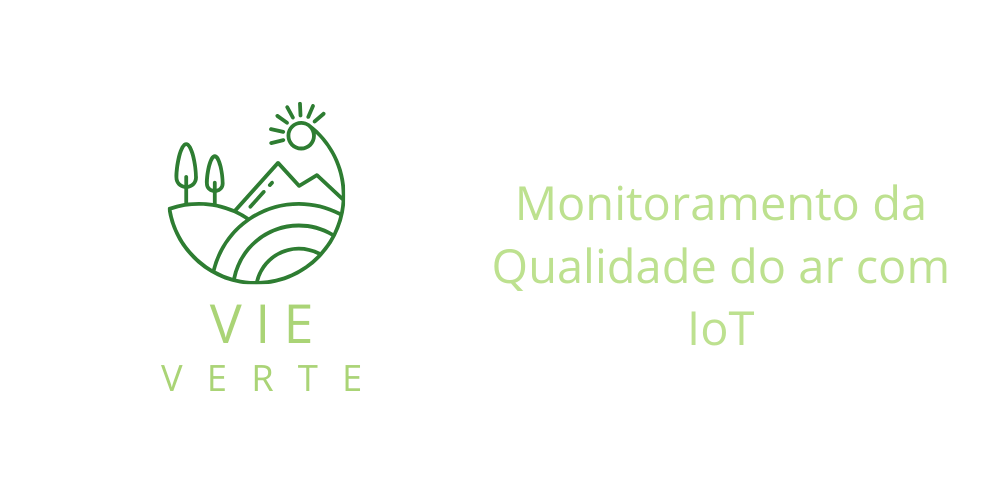

# VIE VERTE
 


<!-- Joana -->
## Descrição
    A VIE VERTE é uma solução para monitoramento da qualidade do ar, desenvolvida com sensores IoT, que fornece dados precisos e em tempo real sobre a poluição do ar. O sistema foi projetado para ser utilizado pela prefeitura da cidade com o objetivo de melhorar a saúde pública, oferecendo alertas de poluição em áreas críticas e promovendo ações preventivas.


<!-- Yara -->
## Objetivo do projeto
    O objetivo do projeto é criar uma plataforma web que permita à prefeitura monitorar a qualidade do ar de maneira eficiente e precisa. Utilizando sensores IoT espalhados pela cidade, o sistema coleta dados em tempo real sobre os níveis de poluição do ar e fornece alertas imediatos em pontos críticos. Com essas informações, será possível adotar medidas para melhorar a saúde pública e a qualidade de vida dos cidadãos.


<!-- Pedro H -->
## Tecnologias utilizadas
1. **Frontend**
    - **Next.js** --> Next para construção de interfaces dinâmicas e escaláveis. Utilizado para criar os dashboards e visualizações de dados, proporcionando uma experiência interativa e de fácil navegação.


2. **Backend**
    - **Java** --> Linguagem de programação utilizada para o desenvolvimento do backend, garantindo robustez e escalabilidade no processamento dos dados recebidos pelos sensores IoT.
    - **Spring** --> Framework Java utilizado para facilitar a criação de APIs RESTful, roteamento, segurança e integração com o banco de dados MySQL.
    - **MQTT** --> Protocolo de comunicação em tempo real utilizado para enviar dados dos sensores IoT para o servidor de forma eficiente e leve.


   
3. **Database**
    - **MySQL** --> Banco de dados relacional para armazenamento dos dados dos sensores e das estatísticas de poluição de forma prática e estruturada.


<!-- Joana -->
## Pré-requisitos
### Antes de começar, garanta que você tem as seguintes ferramentas instaladas::
- **MySQL**: Banco de dados para armazenamento dos dados de qualidade do ar.
- **npm**: Gerenciador de pacotes para instalar as dependências do projeto.
- **Java JDK**: Para executar o backend desenvolvido em Java.
- **Maven**: Para gerenciar dependências do projeto backend em Spring.


<!-- Pedro H -->
## Instalação e uso
1. **Clone o repositório**
    ```bash
    git clone https://github.com/vieverte/vieverte.git
    ```
2. **Instale as dependências do Frontend:**
    ```bash
    cd vieverte/frontend
    npm install
    ```
3. **Instale as dependências do backend:**
    ```bash
    cd vieverte/backend
    mvn install
    ```
4. **Inicie o servidor Frontend:**
    ```bash
    npm start
    ```


5.
    Agora, você pode acessar a plataforma no seu navegador através de http://localhost:3000.


<!-- Yara -->
## Configurações
    1. Sensor IoT
        Para adicionar um novo sensor IoT, registre as informações do dispositivo no banco de dados, incluindo:
            - ID do Sensor
            - Localização
            - Tipo de poluente detectado
            - Data e hora da coleta
   
    2. Alertas de Poluição
        Os alertas são configurados para serem enviados automaticamente quando o nível de poluição ultrapassar um limite predefinido, com base em valores de concentração de poluentes. A configuração pode ser ajustada para diferentes tipos de poluentes, como CO₂, NO₂, entre outros.


<!-- Joana -->
## Fluxo de usuários
    O sistema será utilizado por funcionários da prefeitura, que terão acesso a um painel administrativo com autenticação segura. O fluxo de usuários será o seguinte:


    - Cadastro e Login: Os funcionários serão cadastrados e poderão realizar login no sistema.
   
    - Acesso aos Dashboards: Após o login, eles terão acesso aos dashboards interativos, que apresentam informações sobre os níveis de poluição e temperatura em tempo real.


    - Filtros e Visualização: Os usuários poderão aplicar filtros para visualizar dados específicos de diferentes áreas da cidade.


    - Alertas: O sistema enviará notificações em tempo real sempre que os níveis de poluição atingirem limites críticos, permitindo ações imediatas.


## Contato
- **Email: vieverte@gmail.com**
- **Telefone: +55 47 99190-0179**